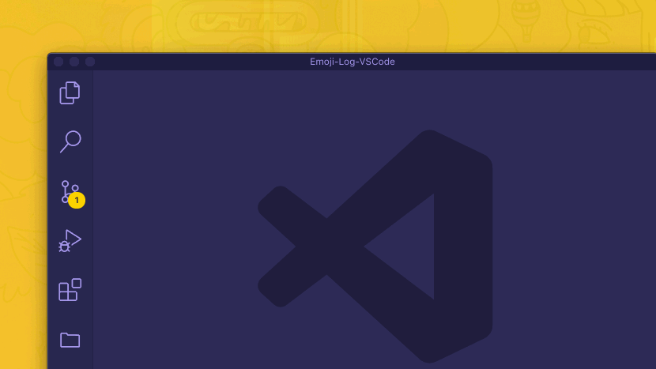

<h1 align="center">
  <a href="https://github.com/ahmadawais/Emoji-Log-VSCode"></a>

`EMOJI-LOG-VSCode`

<div align="center"><p><a href="https://VSCode.pro/?utm_source=EmojiLogVSCode"></a>

</h1>

<h5 align="center">

After building [hundreds of open source software](https://github.com/ahmadawais) I've ended up inventing a git commit log standard called `EMOJI-LOG` that helps me understand a project's history with a less cognitive load just by looking at the git log.

</h5>

## USAGE

1. Open the command palette (macOS: <kbd>`⌘`</kbd> + <kbd>`⇧`</kbd> + <kbd>`P`</kbd> | Win/Linux: <kbd>`⌃`</kbd> + <kbd>`⇧`</kbd> + <kbd>`P`</kbd>)
2. Search and select the `Emoji-Log` option
3. Choose the appropriate Emoji-Log prefix
4. Emoji-Log will add itself to the Git message box as a prefix
5. Write the git commit message and commit it.

[](https://marketplace.visualstudio.com/items?itemName=ahmadawais.emoji-log-vscode)

**ALTERNATIVELY**:

1. Open the Source Control View (where you write the Git commit message)
2. Click the Smile Button ☻ in the navigation menu in the top bar
3. Choose the appropriate Emoji-Log prefix
4. Emoji-Log will add itself to the Git message box as a prefix
5. Write the git commit message and commit it.

<br>


## EASY INSTALLATION

1. Open the extensions sidebar on Visual Studio Code
2. Search for **ahmadawais.emoji-log-vscode**
3. Click **Install** to install it.
4. 🌟 [Rate five-stars](https://marketplace.visualstudio.com/items?itemName=ahmadawais.emoji-log-vscode&ssr=false#review-details).

#### ALTERNATE INSTALLATION

1. Launch Quick Open using <kbd>COMMAND (⌘)</kbd>+<kbd>P</kbd> OR <kbd>CONTROL (⌃)</kbd>+<kbd>P</kbd>.
2. Paste the command `ext install ahmadawais.emoji-log-vscode`
3. Click **Install** to install it.
4. 🌟 [Rate five-stars](https://marketplace.visualstudio.com/items?itemName=ahmadawais.emoji-log-vscode&ssr=false#review-details).


<br>


### PHILOSOPHY

I like emoji. I like ’em a lot. Programming, code, geeks/nerds, open-source, all of that is inherently dull and sometimes boring. Emoji (which is, in fact, the plural of emoji) helps me add colors and emotions to the mix. Nothing wrong if you want to attach feelings to this 2D flat text-based world of code. I found out that instead of memorizing [hundreds of emoji](https://gitmoji.carloscuesta.me/) it's better to keep the categories small and general.

1. **IMPERATIVE** ↓
    - Make your Git commit messages imperative.
    - Write a commit message like you're giving an order.
    - E.g., Use ✅ `Add` instead of ❌ `Added`.
    - E.g., Use ✅ `Create` instead of ❌ `Creating`.
1. **RULES** ↓
    - A small number of categories — easy to memorize.
    - Nothing more nothing less.
    - E.g. `📦 NEW`, `👌 IMPROVE`, `🐛 FIX`, `📖 DOC`, `🚀 RELEASE`, `🤖 TEST`, and `‼️ BREAKING`
1. **ACTIONS** ↓
    - Make git commits based on the actions you take.
    - Use a good editor like [VSCode](https://code.visualstudio.com/) to commit the right files with commit messages.

<br>


### GETTING STARTED

Only use the following Git Commit Messages. A simple and small footprint is critical here.

1. `📦 NEW: IMPERATIVE_MESSAGE_GOES_HERE`
    > Use when you add something entirely new.
    > E.g. `📦 NEW: Add Git ignore file`

1. `👌 IMPROVE: IMPERATIVE_MESSAGE_GOES_HERE`
    > Use when you improve/enhance piece of code like refactoring etc.
    > E.g. `👌 IMPROVE: Remote IP API Function`

1. `🐛 FIX: IMPERATIVE_MESSAGE_GOES_HERE`
    > Use when you fix a bug — need I say more?
    > E.g. `🐛 FIX: Case conversion`

1. `📖 DOC: IMPERATIVE_MESSAGE_GOES_HERE`
    > Use when you add documentation like `README.md`, or even inline docs.
    > E.g. `📖 DOC: API Interface Tutorial`

1. `🚀 RELEASE: IMPERATIVE_MESSAGE_GOES_HERE`
    > Use when you release a new version.
    > E.g. `🚀 RELEASE: Version 2.0.0`

1. `🤖 TEST: IMPERATIVE_MESSAGE_GOES_HERE`
    > Use when it's related to testing.
    > E.g. `🤖 TEST: Mock User Login/Logout`

1. `‼️ BREAKING: IMPERATIVE_MESSAGE_GOES_HERE`
    > Use when releasing a change that breaks previous versions.
    > E.g. `‼️ BREAKING: Change authentication protocol`

_— That's it for now. Nothing more nothing less._

<br>


#### THE WORKFLOW & MEANINGS

I'd like to share what each of these emojis mean.

- `📦 NEW:` Emoji meaning: A "package emoji" — which can contain new stuff.
- `👌 IMPROVE:` Emoji meaning: An "OK Hand emoji" — which is meant to appreciate an improvement.
- `🐛 FIX:` Emoji meaning: A "bug emoji" — which means there was a bug that got fixed.
- `📖 DOCS:` Emoji meaning: A "book emoji" — which means documentation or notes just like in a book.
- `🚀 RELEASE:` Emoji meaning: A "rocket emoji" — which is meant to show a new release/launch.
- `🤖 TEST:` Emoji meaning: A "robot emoji" — which says some test were run successfully.
- `‼️ BREAKING:` Emoji meaning: A "bangbang emoji" — which attracts attention to a breaking change.

##### VSCode Extension

If you use VSCode, then I have built an extension [Emoji-Log for VSCode](https://marketplace.visualstudio.com/items?itemName=ahmadawais.emoji-log-vscode). This can help you write git commit messages quickly.

##### Bash/Zsh Workflow

For quick prototyping, I have made the following functions that you can add to your `.bashrc`/`.zshrc` files and use Emoji-Log quickly.

```sh
#.# Better Git Logs.
### Using EMOJI-LOG (https://github.com/ahmadawais/Emoji-Log).

# Git Commit, Add all and Push — in one step.
gcap() {
    git add . && git commit -m "$*" && git push
}

# NEW.
gnew() {
    gcap "📦 NEW: $@"
}

# IMPROVE.
gimp() {
    gcap "👌 IMPROVE: $@"
}

# FIX.
gfix() {
    gcap "🐛 FIX: $@"
}

# RELEASE.
grlz() {
    gcap "🚀 RELEASE: $@"
}

# DOC.
gdoc() {
    gcap "📖 DOC: $@"
}

# TEST.
gtst() {
    gcap "🤖 TEST: $@"
}

# BREAKING CHANGE.
gbrk() {
    gcap "‼️ BREAKING: $@"
}
gtype() {
NORMAL='\033[0;39m'
GREEN='\033[0;32m'
echo "$GREEN gnew$NORMAL — 📦 NEW
$GREEN gimp$NORMAL — 👌 IMPROVE
$GREEN gfix$NORMAL — 🐛 FIX
$GREEN grlz$NORMAL — 🚀 RELEASE
$GREEN gdoc$NORMAL — 📖 DOC
$GREEN gtst$NORMAL — 🧪️ TEST
$GREEN gbrk$NORMAL — ‼️ BREAKING"
}
```

##### Fish Shell Workflow

To install these functions for the fish shell, run the following commands:

```sh
function gcap; git add .; and git commit -m "$argv"; and git push; end;
function gnew; gcap "📦 NEW: $argv"; end
function gimp; gcap "👌 IMPROVE: $argv"; end;
function gfix; gcap "🐛 FIX: $argv"; end;
function grlz; gcap "🚀 RELEASE: $argv"; end;
function gdoc; gcap "📖 DOC: $argv"; end;
function gtst; gcap "🤖 TEST: $argv"; end;
function gbrk; gcap "‼️ BREAKING: $argv"; end;
funcsave gcap
funcsave gnew
funcsave gimp
funcsave gfix
funcsave grlz
funcsave gdoc
funcsave gtst
funcsave gbrk
```

##### Git Aliases

If you prefer, you can paste these aliases directly in your `~/.gitconfig` file:

```sh
# Make sure you're adding under the [alias] block.
[alias]
  # Git Commit, Add all and Push — in one step.
  cap = "!f() { git add .; git commit -m \"$@\"; git push; }; f"

  # NEW.
  new = "!f() { git cap \"📦 NEW: $@\"; }; f"
  # IMPROVE.
  imp = "!f() { git cap \"👌 IMPROVE: $@\"; }; f"
  # FIX.
  fix = "!f() { git cap \"🐛 FIX: $@\"; }; f"
  # RELEASE.
  rlz = "!f() { git cap \"🚀 RELEASE: $@\"; }; f"
  # DOC.
  doc = "!f() { git cap \"📖 DOC: $@\"; }; f"
  # TEST.
  tst = "!f() { git cap \"🤖 TEST: $@\"; }; f"
  # BREAKING CHANGE.
  brk = "!f() { git cap \"‼️ BREAKING: $@\"; }; f"
```

<br>


### USING `EMOJI-LOG`

Here's a list of repos that make use of Emoji-Log.

- [Create-Guten-Block Toolkit →](https://github.com/ahmadawais/create-guten-block/commits/)
- [VSCode Shades of Purple Theme →](https://github.com/ahmadawais/shades-of-purple-vscode/commits/)
- [Ahmad Awais GitHub Repos →](https://github.com/ahmadawais) — _Latest repos on this account._
- [CaptainCore CLI (WordPress Management Toolkit) →](https://github.com/CaptainCore/captaincore-cli/commits/)
- [CaptainCore GUI (WordPress plugin) →](https://github.com/CaptainCore/captaincore-gui/commits/)
- **You?!** Add your repo to the list after adding the Emoji-log badge to your readme.

<br>


### Alfred Snippets

[Alfred](https://www.alfredapp.com/) [PowerPack](https://www.alfredapp.com/powerpack/) users can use the Snippets feature to quickly call Emoji-Log, or use the text expand feature for even quicker creation.

To setup:

1. Have Alfred 3 with PowerPack installed
2. For auto expansion, in _Alfred Settings » Features » Snippets_ ensure the "Automatically expand snippets by Keyword" box is checked
3. Download & open [`Emoji-Log.alfredsnippets`](Emoji-Log.alfredsnippets), deselecting "Strip snippets of 'auto expand' flag" when prompted

This will give the following text expander keywords for the Emoji-Log:

| Keyword |   Snippet    |
| ------- | ------------ |
| `;gnew` | 📦 NEW:      |
| `;gimp` | 👌 IMPROVE:  |
| `;gfix` | 🐛 FIX:      |
| `;grlz` | 🚀 RELEASE:  |
| `;gdoc` | 📖 DOC:      |
| `;gtst` | 🤖 TEST:     |
| `;gbrk` | ‼️ BREAKING:  |

To edit the `;` prefix to your preferred expansion flag, double click right click the Emoji-Log Collection in _Alfred Settings » Features » Snippets_.

> TextExpander Snippets are also available. Download & open [`Emoji-Log.textexpander`](Emoji-Log.textexpander) to import.

<br>


### `EMOJI-LOG` BADGE COLLECTION

If your repo uses `EMOJI-LOG` then you can add any of the following badges to your read me and send me a PR to list your repo here.

<br>


- **STYLE**: Flat Square
- **MARKDOWN** ↓

```markdown
[](https://github.com/ahmadawais/Emoji-Log/)
```

- **HTML** ↓

```html
<a href="https://github.com/ahmadawais/Emoji-Log/"></a>
```

<br>


- **STYLE**: Flat Rounded
- **MARKDOWN** ↓

```markdown
[](https://github.com/ahmadawais/Emoji-Log/)
```

- **HTML** ↓

```html
<a href="https://github.com/ahmadawais/Emoji-Log/"></a>
```

<br>


- **STYLE**: Non-flat Rounded
- **MARKDOWN** ↓

```markdown
[](https://github.com/ahmadawais/Emoji-Log/)
```

- **HTML** ↓

```html
<a href="https://github.com/ahmadawais/Emoji-Log/"></a>
```

<br>

[](./../../)

## Sponsor

Me ([Ahmad Awais](https://twitter.com/mrahmadawais/)) and my incredible wife ([Maedah Batool](https://twitter.com/MaedahBatool/)) are two engineers who fell in love with open source and then with each other. You can read more [about me here](https://ahmadawais.com/about). If you or your company use any of my projects or like what I’m doing then consider backing me. I'm in this for the long run. An open-source developer advocate.

- 🌟  **$9.99/month (recommended)** ❯ [Two cups of Caffè latte (coffee) every month →](https://pay.paddle.com/checkout/540217)
- 🚀  **$99.99 (one-time sponsor)** ❯ [Support an hour of open-source code →](https://pay.paddle.com/checkout/515568)
- 🔰  **$49.99 (one-time sponsor)** ❯ [Support an hour of maintenance →](https://pay.paddle.com/checkout/527253)
- ☕️  **$9.99 (one-time sponsor)** ❯ [Lunch/coffee →](https://pay.paddle.com/checkout/527254)

<br>

[](./../../)

## License & Conduct

- MIT © [Ahmad Awais](https://twitter.com/MrAhmadAwais/)
- [Code of Conduct](code-of-conduct.md)
- [Munawar](https://munwr.com/) for making awesome badges

<br>

[](./../../)

## Connect


<div align="left"><p><a href="https://nodecli.com/?utm_source=github.com/ahmadawais&utm_medium=referral&utm_campaign=profile"></a>&nbsp; <strong>IMP:</strong> I'm teaching developers how to automate their work and life with JavaScript
</p></div>

<div align="left">
    <p><a href="https://twitter.com/MrAhmadAwais/"></a>&nbsp;<small> <strong>(follow)</strong> To get <a href="https://Awais.dev/odmt">#OneDevMinute</a> development tips</small></p>
    <p><a href="https://github.com/AhmadAwais"></a>&nbsp;<small><strong>(follow)</strong> 200+ FOSS software projects</small></p>
    <p><a href="https://www.youtube.com/AhmadAwais"></a>&nbsp;<small><strong>(subscribe)</strong> Tech talks & #OneDevMinute videos</small></p>
    <p><a href="https://AhmadAwais.com/"></a>&nbsp;<small><strong>(read)</strong> In-depth & long form technical articles</small></p>
    <p><a href="https://www.linkedin.com/in/MrAhmadAwais/"></a>&nbsp;<small><strong>(connect)</strong> On LinkedIn y'all</small></p>
</div>

[][s]

<small><strong>❯❯ Professional Development Courses ↓</strong></small>

[][n] [][v] [%20%E2%86%92-gray.svg?colorA=6B999F&colorB=6A788D&style=for-the-badge)][d]


[s]: https://github.com/AhmadAwais/sponsor
[n]: https://NodeCLI.com?utm_source=github.com/ahmadawais&utm_medium=referral&utm_campaign=profile
[v]: https://VSCode.pro?utm_source=github.com/ahmadawais&utm_medium=referral&utm_campaign=profile
[d]: https://DenoBeginner.com?utm_source=github.com/ahmadawais&utm_medium=referral&utm_campaign=profile
[g]: https://github.com/AhmadAwais


[course]: https://VSCode.pro/?utm_source=EmojiLogVSCode
